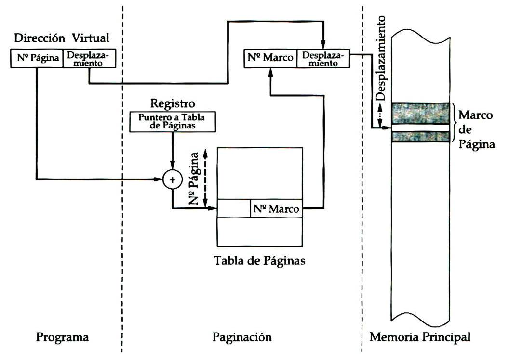

# ACTIVIDADES

## 3.1 Politica y filosofia

#### Pregunta 1: Cuál es la diferencia entre fragmentación interna y externa? Explica cómo cada una afecta el rendimiento de la memoria.

Fragmentación Interna

Definición: Espacio desperdiciado dentro de un bloque de memoria asignado
Causa: Asignación de memoria en bloques de tamaño fijo
Impacto: Reduce la eficiencia del uso de memoria
Ejemplo: Si un proceso requiere 70 KB y se le asigna un bloque de 100 KB, 30 KB quedan sin usar

Fragmentación Externa

Definición: Espacios libres no contiguos que no pueden ser utilizados
Causa: Asignación y liberación frecuente de memoria
Impacto: Dificulta la asignación de nuevos procesos
Ejemplo: Memoria dividida en pequeños segmentos dispersos que no pueden combinarse para un proceso grande

#### Pregunta 2: Investiga y explica las políticas de reemplazo de páginas en sistemas operativos. ¿Cuál consideras más eficiente y por qué?

Políticas Principales:

FIFO (First In, First Out)

* Reemplaza la página más antigua
* Simple de implementar
* o considera el uso real de la página


LRU (Least Recently Used)

* Reemplaza la página que no se ha usado por más tiempo
* Más eficiente
* Refleja mejor los patrones de acceso a memoria


Óptimo

* Reemplaza la página que no se usará por más tiempo en el futuro
* Teóricamente ideal, pero imposible de implementar perfectamente

*Política Más Eficiente: LRU* 

Razones:

* Considera el historial reciente de accesos
* Minimiza la probabilidad de reemplazar páginas importantes
* Equilibra rendimiento y complejidad computacional


## 3.2 Memoria real

### Programa de simulacion de administracion de memoria

```Python
class MemoryPartition:
    def __init__(self, size, name):
        self.size = size
        self.name = name
        self.process = None
    
    def assign_process(self, process):
        if process.size <= self.size:
            self.process = process
            return True
        return False
    
    def free_partition(self):
        self.process = None

class Process:
    def __init__(self, pid, size):
        self.pid = pid
        self.size = size

class MemoryManager:
    def __init__(self, partition_sizes):
        self.partitions = [MemoryPartition(size, f'Partición {i+1}') 
                           for i, size in enumerate(partition_sizes)]
    
    def assign_process(self, process):
        for partition in self.partitions:
            if partition.process is None and partition.assign_process(process):
                print(f"Proceso {process.pid} asignado a {partition.name}")
                return True
        
        print(f"No se pudo asignar el Proceso {process.pid}")
        return False
    
    def free_process(self, pid):
        for partition in self.partitions:
            if partition.process and partition.process.pid == pid:
                print(f"Proceso {pid} liberado de {partition.name}")
                partition.free_partition()
                return True
        
        print(f"Proceso {pid} no encontrado")
        return False
    
    def show_memory_status(self):
        print("\nEstado Actual de la Memoria:")
        for partition in self.partitions:
            if partition.process:
                print(f"{partition.name} ({partition.size} KB): Proceso {partition.process.pid} ({partition.process.size} KB)")
            else:
                print(f"{partition.name} ({partition.size} KB): Libre")

def main():
    partition_sizes = [100, 200, 300, 400]
    
    memory_manager = MemoryManager(partition_sizes)
    
    processes = [
        Process(1, 50),   
        Process(2, 150),  
        Process(3, 250),  
        Process(4, 350),  
        Process(5, 100)   
    ]
    
    print("Simulación de Asignación de Memoria")
    for process in processes:
        memory_manager.assign_process(process)
        memory_manager.show_memory_status()
    
    print("\nSimulación de Liberación de Memoria")
    memory_manager.free_process(2)
    memory_manager.show_memory_status()
    
    new_process = Process(6, 150)
    memory_manager.assign_process(new_process)
    memory_manager.show_memory_status()

if __name__ == "__main__":
    main()
```

## 3.3 Organizacion de memoria virtual 
### Investiga y explica el concepto de "paginación" y "segmentación". ¿Cuáles son las ventajas y desventajas de cada técnica?

Paginación vs Segmentación

*Paginación*

Ventajas:

* No hay fragmentación externa
* Implementación simple
* Gestión eficiente de memoria


Desventajas:

* Fragmentación interna
* Overhead en tabla de páginas
* Posible desperdicio de memoria


*Segmentación*

Ventajas:
*  Asignación más natural
* Soporta diferentes tamaños de segmentos
* Mejor organización lógica de memoria


Desventajas:

* Fragmentación externa
* Gestión más compleja
* Mayor overhead administrativo

### Programa de simulacion de na tabla de páginas para procesos con acceso aleatorio a memoria virtual 

```Python
import random

class Page:
    def __init__(self, page_number, frame_number=None, valid=False):
        self.page_number = page_number
        self.frame_number = frame_number
        self.valid = valid
        self.referenced = False
        self.modified = False

class PageTable:
    def __init__(self, process_id, num_pages, page_size, memory_size):
        self.process_id = process_id
        self.page_size = page_size
        self.memory_size = memory_size
        self.num_frames = memory_size // page_size
        self.pages = [Page(i) for i in range(num_pages)]
        self.page_faults = 0
        self.memory_frames = [None] * self.num_frames

    def map_page(self, page_number):
        if 0 <= page_number < len(self.pages):
            page = self.pages[page_number]
            
            if not page.valid:
                self.page_faults += 1
                
                if None in self.memory_frames:
                    frame_index = self.memory_frames.index(None)
                else:
                    frame_index = self._select_victim_frame()
                
                page.frame_number = frame_index
                page.valid = True
                page.referenced = True
                self.memory_frames[frame_index] = page
            
            return page
        
        raise ValueError(f"Página {page_number} no existe")

    def _select_victim_frame(self):
        for i, frame in enumerate(self.memory_frames):
            if frame and not frame.referenced:
                return i
        
        return random.randint(0, self.num_frames - 1)

    def access_page(self, page_number, is_write=False):
        page = self.map_page(page_number)
        page.referenced = True
        
        if is_write:
            page.modified = True
        
        return page

    def print_page_table(self):
        print(f"\nTabla de Páginas - Proceso {self.process_id}")
        print("Página\tMarco\tValida\tReferenciada\tModificada")
        for page in self.pages:
            print(f"{page.page_number}\t{page.frame_number if page.frame_number is not None else '-'}\t"
                  f"{page.valid}\t{page.referenced}\t\t{page.modified}")

def simulate_process_memory_access(page_table, num_accesses):
    print(f"\nSimulando {num_accesses} accesos a memoria para el Proceso {page_table.process_id}")
    
    for _ in range(num_accesses):
        page_number = random.randint(0, len(page_table.pages) - 1)
        is_write = random.choice([True, False])
        
        print(f"\nAccediendo Página {page_number} ({'Escritura' if is_write else 'Lectura'})")
        page = page_table.access_page(page_number, is_write)
        page_table.print_page_table()
    
    print(f"\nTotal de Fallos de Página: {page_table.page_faults}")

def main():
    process_id = 1
    num_pages = 16
    page_size = 4096  # 4 KB
    memory_size = 32768  # 32 KB

    page_table = PageTable(process_id, num_pages, page_size, memory_size)
    
    simulate_process_memory_access(page_table, 10)

if __name__ == "__main__":
    main()
```


## 3.4 Administracion de memoria virtual
###  Programa de LRU

```Python

def lru_replacement(pages, capacity):
    memory = []  # Lista que representa las páginas en memoria.
    page_faults = 0  # Contador de fallos de página.

    for page in pages:
        if page not in memory:
            # Si la página no está en memoria (fallo de página).
            page_faults += 1

            if len(memory) == capacity:
                # Si la memoria está llena, eliminar la menos recientemente usada.
                memory.pop(0)
            
            # Agregar la nueva página a la memoria.
            memory.append(page)
        else:
            # Si la página ya está en memoria, moverla al final (más recientemente usada).
            memory.remove(page)
            memory.append(page)

        # Mostrar el estado de la memoria después de cada acceso.
        print(f"Acceso a la página {page}: Memoria -> {memory}")

    return page_faults

# Ejemplo de uso
pages = [1, 2, 3, 4, 1, 2, 5, 1, 2, 3, 4, 5]  # Secuencia de acceso a páginas.
capacity = 3  # Capacidad máxima de memoria.
result = lru_replacement(pages, capacity)
print(f"\nTotal de fallos de página: {result}")
```

### Diagrama que represente el proceso de traducción de direcciones virtuales a físicas en un sistema con memoria virtual.



```Python
class MemoryManager:
    def __init__(self, memory_size):
        self.memory_size = memory_size  # Tamaño total de la memoria
        self.memory = []  # Espacios de memoria ocupados por procesos
        self.swap_space = []  # Espacio de swap para procesos removidos de la memoria

    def load_process(self, process_id, size):
        if size > self.memory_size:
            print(f"Error: El proceso {process_id} excede el tamaño de la memoria.")
            return

        while self.get_used_memory() + size > self.memory_size:
            self.swap_process()

        self.memory.append({"id": process_id, "size": size})
        print(f"Proceso {process_id} cargado en memoria.")

    def swap_process(self):
        if not self.memory:
            print("No hay procesos para intercambiar.")
            return

        swapped_process = self.memory.pop(0)  # Retirar el primer proceso cargado (FIFO)
        self.swap_space.append(swapped_process)
        print(f"Proceso {swapped_process['id']} movido al espacio de swap.")

    def get_used_memory(self):
        return sum(process["size"] for process in self.memory)

    def show_memory(self):
        print("\nEstado de la memoria:")
        print(f"Memoria utilizada: {self.get_used_memory()} / {self.memory_size}")
        print("Procesos en memoria:")
        for process in self.memory:
            print(f" - ID: {process['id']}, Tamaño: {process['size']}")
        print("Procesos en swap:")
        for process in self.swap_space:
            print(f" - ID: {process['id']}, Tamaño: {process['size']}")
        print("\n")

# Simulación de swapping
if __name__ == "__main__":
    memory_manager = MemoryManager(memory_size=100)

    # Cargando procesos
    memory_manager.load_process("P1", 40)
    memory_manager.show_memory()

    memory_manager.load_process("P2", 50)
    memory_manager.show_memory()

    memory_manager.load_process("P3", 30)  # Forzará el swapping
    memory_manager.show_memory()

    memory_manager.load_process("P4", 60)  # Forzará más swapping
    memory_manager.show_memory()
```

## Administracion de entrada y salida
## 4.1 Dispositivos y manejadores de dispositivo

### Diferencia entre Dispositivos de Bloque y de Carácter

Dispositivos de Bloque:

* Almacenan datos en bloques de tamaño fijo
* Acceso aleatorio a los datos
* Ejemplos:

    * Discos duros
    * Unidades SSD
    * Memorias USB


Dispositivos de Carácter:

* Transmiten datos carácter por carácter
* Acceso secuencial
* Ejemplos:

    * Teclado
    * Impresora
    * Puertos serie


### Programa de manejador de dispositivos

```Python
class VirtualInputDevice:
    def __init__(self, device_name):
        self.device_name = device_name
        self.buffer = []  # Buffer para almacenar datos recibidos
        self.status = "IDLE"  # Estado inicial del dispositivo (IDLE, READING, ERROR)

    def read_data(self, data):
        """Simula la lectura de datos desde el dispositivo."""
        if not isinstance(data, str):
            self.status = "ERROR"
            print(f"[{self.device_name}] Error: Datos inválidos.")
            return
        self.status = "READING"
        self.buffer.append(data)
        print(f"[{self.device_name}] Dato recibido: '{data}'")

    def clear_buffer(self):
        """Limpia el buffer del dispositivo."""
        self.buffer = []
        self.status = "IDLE"
        print(f"[{self.device_name}] Buffer limpiado.")

    def get_status(self):
        """Devuelve el estado actual del dispositivo."""
        return self.status

    def show_buffer(self):
        """Muestra los datos almacenados en el buffer."""
        if not self.buffer:
            print(f"[{self.device_name}] El buffer está vacío.")
        else:
            print(f"[{self.device_name}] Datos en buffer: {self.buffer}")


# Controlador para interactuar con el dispositivo
def device_controller():
    device = VirtualInputDevice("VirtualKeyboard")

    while True:
        print("\n--- Controlador del Dispositivo ---")
        print("1. Leer dato del dispositivo")
        print("2. Mostrar buffer")
        print("3. Limpiar buffer")
        print("4. Mostrar estado del dispositivo")
        print("5. Salir")

        choice = input("Seleccione una opción: ")

        if choice == "1":
            data = input("Ingrese el dato a leer: ")
            device.read_data(data)
        elif choice == "2":
            device.show_buffer()
        elif choice == "3":
            device.clear_buffer()
        elif choice == "4":
            print(f"Estado del dispositivo: {device.get_status()}")
        elif choice == "5":
            print("Saliendo del controlador...")
            break
        else:
            print("Opción no válida. Intente de nuevo.")

# Ejecutar el controlador
if __name__ == "__main__":
    device_controller()
```

## 4.2 Mecanismos y funciones de los manejadores de dispositivos

### Pseudocodigo de interrupciones

```
Función manejarInterrupcionES():
    Si hayInterrupción():
        Guardar estado actual del procesador
        Identificar fuente de interrupción
        Según fuente:
            Caso TECLADO:
                Leer datos del teclado
                Procesar entrada
            Caso DISCO:
                Completar operación de lectura/escritura
                Actualizar estado del dispositivo
            Caso RED:
                Procesar paquete recibido
                Preparar respuesta
        Restaurar estado del procesador
        Continuar ejecución
```

### Programa que utilice el manejo de interrupciones en un sistema básico de simulación

```Python

import queue
import time
import random

class Interrupt:
    """Clase que representa una interrupción."""
    def __init__(self, device_id, message):
        self.device_id = device_id  
        self.message = message     

    def __str__(self):
        return f"Interrupción del dispositivo {self.device_id}: {self.message}"


class InterruptHandler:
    """Clase que maneja las interrupciones."""
    def __init__(self):
        self.interrupt_queue = queue.Queue()  

    def add_interrupt(self, interrupt):
        """Agrega una interrupción a la cola."""
        self.interrupt_queue.put(interrupt)
        print(f"[Handler] Interrupción recibida: {interrupt}")

    def handle_interrupts(self):
        """Gestiona las interrupciones en la cola."""
        while not self.interrupt_queue.empty():
            interrupt = self.interrupt_queue.get()
            print(f"[Handler] Gestionando: {interrupt}")
            time.sleep(1) 


class Device:
    """Clase que representa un dispositivo generador de interrupciones."""
    def __init__(self, device_id, handler):
        self.device_id = device_id  
        self.handler = handler     

    def generate_interrupt(self):
        """Genera una interrupción aleatoria."""
        messages = ["Lectura completada", "Error en el dispositivo", "Operación finalizada"]
        message = random.choice(messages)
        interrupt = Interrupt(self.device_id, message)
        self.handler.add_interrupt(interrupt)


def simulation():
    """Función principal que simula el sistema con interrupciones."""
    handler = InterruptHandler()  
    devices = [Device(i, handler) for i in range(3)] 

    print("Iniciando simulación del sistema...")
    for _ in range(5):  
        for device in devices:
            if random.random() > 0.5:  
                device.generate_interrupt()

        handler.handle_interrupts()

        time.sleep(2)  
    print("Simulación finalizada.")

if __name__ == "__main__":
    simulation()

```

## 4.3 Estructura de datos para el manejo de dispositivos

### Investiga y explica que es una cola de E/S. Diseña una simulacion de una cola con prioridad

Una cola de E/S es una estructura de datos utilizada en sistemas operativos y dispositivos de hardware para gestionar múltiples solicitudes de entrada/salida (lectura/escritura de datos). Estas colas organizan las peticiones en un orden que puede ser FIFO (primero en entrar, primero en salir) o basado en prioridades para maximizar la eficiencia y reducir la latencia en los dispositivos, como discos duros, redes o impresoras.


```Python
import heapq

class ColaPrioridad:
    def __init__(self):
        self.cola = []  # Lista para almacenar las solicitudes como un heap

    def agregar_solicitud(self, prioridad, solicitud):
        """Agrega una solicitud a la cola con su prioridad."""
        heapq.heappush(self.cola, (prioridad, solicitud))
        print(f"Solicitud '{solicitud}' agregada con prioridad {prioridad}.")

    def procesar_solicitud(self):
        """Procesa la solicitud con mayor prioridad."""
        if self.cola:
            prioridad, solicitud = heapq.heappop(self.cola)
            print(f"Procesando solicitud '{solicitud}' con prioridad {prioridad}.")
        else:
            print("No hay solicitudes en la cola.")

    def mostrar_cola(self):
        """Muestra las solicitudes pendientes en la cola."""
        if self.cola:
            print("Solicitudes en la cola:")
            for prioridad, solicitud in sorted(self.cola):
                print(f" - {solicitud} (Prioridad: {prioridad})")
        else:
            print("La cola está vacía.")

# Simulación
cola_e_s = ColaPrioridad()
cola_e_s.agregar_solicitud(2, "Leer archivo")
cola_e_s.agregar_solicitud(1, "Escribir en disco")
cola_e_s.agregar_solicitud(3, "Imprimir documento")

cola_e_s.mostrar_cola()
cola_e_s.procesar_solicitud()
cola_e_s.procesar_solicitud()
cola_e_s.mostrar_cola()
```
### Programa que simula las operaciones de un manejador de dispositivos utilizando una tabla de estructuras.

```Python
class ManejadorDispositivos:
    def __init__(self):
        self.tabla_dispositivos = {}  # Tabla para almacenar los dispositivos

    def registrar_dispositivo(self, id_dispositivo, estado="inactivo"):
        """Registra un nuevo dispositivo en la tabla."""
        if id_dispositivo not in self.tabla_dispositivos:
            self.tabla_dispositivos[id_dispositivo] = {
                "estado": estado,
                "cola_solicitudes": []
            }
            print(f"Dispositivo '{id_dispositivo}' registrado con estado '{estado}'.")
        else:
            print(f"El dispositivo '{id_dispositivo}' ya está registrado.")

    def enviar_solicitud(self, id_dispositivo, solicitud):
        """Envía una solicitud a la cola de un dispositivo."""
        if id_dispositivo in self.tabla_dispositivos:
            self.tabla_dispositivos[id_dispositivo]["cola_solicitudes"].append(solicitud)
            print(f"Solicitud '{solicitud}' agregada al dispositivo '{id_dispositivo}'.")
            if self.tabla_dispositivos[id_dispositivo]["estado"] == "inactivo":
                self.tabla_dispositivos[id_dispositivo]["estado"] = "activo"
        else:
            print(f"El dispositivo '{id_dispositivo}' no está registrado.")

    def procesar_solicitud(self, id_dispositivo):
        """Procesa la primera solicitud en la cola del dispositivo."""
        if id_dispositivo in self.tabla_dispositivos:
            dispositivo = self.tabla_dispositivos[id_dispositivo]
            if dispositivo["cola_solicitudes"]:
                solicitud = dispositivo["cola_solicitudes"].pop(0)
                dispositivo["estado"] = "ocupado"
                print(f"Procesando solicitud '{solicitud}' en el dispositivo '{id_dispositivo}'.")
                if not dispositivo["cola_solicitudes"]:
                    dispositivo["estado"] = "inactivo"
            else:
                print(f"No hay solicitudes pendientes para el dispositivo '{id_dispositivo}'.")
        else:
            print(f"El dispositivo '{id_dispositivo}' no está registrado.")

    def mostrar_estado(self):
        """Muestra el estado de todos los dispositivos."""
        print("Estado actual de los dispositivos:")
        for id_dispositivo, info in self.tabla_dispositivos.items():
            estado = info["estado"]
            cola = info["cola_solicitudes"]
            print(f" - {id_dispositivo}: Estado = {estado}, Solicitudes pendientes = {len(cola)}")

# Simulación
manejador = ManejadorDispositivos()

manejador.registrar_dispositivo("DiscoDuro1")
manejador.registrar_dispositivo("Impresora1")
manejador.registrar_dispositivo("TarjetaRed1")

manejador.enviar_solicitud("DiscoDuro1", "Leer archivo")
manejador.enviar_solicitud("Impresora1", "Imprimir documento")
manejador.enviar_solicitud("DiscoDuro1", "Escribir archivo")
manejador.enviar_solicitud("TarjetaRed1", "Enviar datos")

manejador.mostrar_estado()

manejador.procesar_solicitud("DiscoDuro1")
manejador.procesar_solicitud("Impresora1")
manejador.procesar_solicitud("TarjetaRed1")

manejador.mostrar_estado()

```
## 4.4 Operaciones de entrada salida

### Diseña un flujo que describa el proceso de lectura de un archivo desde un disco magnético. Acompáñalo con un programa básico que simule el proceso.

Solicitud de Lectura

El sistema operativo recibe una solicitud del usuario o aplicación para leer un archivo.

Búsqueda en el Sistema de Archivos
El sistema operativo consulta la tabla de archivos (como FAT o MFT) para localizar el archivo solicitado.

Localización de Bloques Físicos
El manejador de dispositivos traduce la ubicación lógica del archivo a sectores físicos en el disco.

Movimiento del Brazo del Cabezal
El brazo del cabezal se mueve hacia el cilindro donde se encuentra el archivo (seek time).

Rotación del Disco
El disco gira hasta que el cabezal puede leer el sector deseado (latencia rotacional).

Transferencia de Datos
Los datos del sector son leídos y enviados al sistema operativo.

Entrega a la Aplicación
Los datos leídos son entregados a la aplicación que los solicitó.

PROGRAMA


```python 
import time
import random

class DiscoMagnetico:
    def __init__(self, sectores):
        self.sectores = sectores  # Diccionario de sectores con contenido

    def buscar_archivo(self, nombre_archivo):
        """Busca el archivo en el sistema de archivos."""
        print("Buscando el archivo en el sistema de archivos...")
        time.sleep(1)
        if nombre_archivo in self.sectores:
            print(f"Archivo '{nombre_archivo}' encontrado.")
            return self.sectores[nombre_archivo]
        else:
            print(f"Archivo '{nombre_archivo}' no encontrado.")
            return None

    def mover_brazo(self, sector):
        """Simula el movimiento del brazo del cabezal."""
        print(f"Moviendo el brazo al sector {sector}...")
        time.sleep(random.uniform(0.5, 1.5))  # Simula tiempo de búsqueda
        print(f"Brazo posicionado en el sector {sector}.")

    def leer_sector(self, sector):
        """Simula la lectura de un sector."""
        print(f"Leyendo datos del sector {sector}...")
        time.sleep(random.uniform(0.5, 1.0))  # Simula tiempo de lectura
        return self.sectores.get(sector, "Sector vacío")

    def leer_archivo(self, nombre_archivo):
        """Proceso completo de lectura de un archivo."""
        ubicacion = self.buscar_archivo(nombre_archivo)
        if ubicacion:
            contenido = []
            for sector in ubicacion:
                self.mover_brazo(sector)
                contenido.append(self.leer_sector(sector))
            print("Archivo leído con éxito.")
            return "\n".join(contenido)
        else:
            print("No se pudo leer el archivo.")
            return None

# Simulación
sectores_disco = {
    "archivo1.txt": [3, 7, 15],
    "archivo2.txt": [8, 12],
    3: "Contenido del archivo1 - Parte 1",
    7: "Contenido del archivo1 - Parte 2",
    15: "Contenido del archivo1 - Parte 3",
    8: "Contenido del archivo2 - Parte 1",
    12: "Contenido del archivo2 - Parte 2"
}

disco = DiscoMagnetico(sectores_disco)

# Leer un archivo
print("\n--- Proceso de Lectura de archivo1.txt ---")
contenido = disco.leer_archivo("archivo1.txt")
if contenido:
    print("\nContenido del archivo:\n")
    print(contenido)

print("\n--- Proceso de Lectura de archivo2.txt ---")
contenido = disco.leer_archivo("archivo2.txt")
if contenido:
    print("\nContenido del archivo:\n")
    print(contenido)

print("\n--- Intento de Leer archivo no existente ---")
disco.leer_archivo("archivo3.txt")

```

### Implementa un programa en Python, C o java que realice operaciones de entrada/salida asíncronas usando archivos

```python
import asyncio

async def escribir_archivo(ruta, contenido):
    """Escribe contenido en un archivo de manera asíncrona."""
    print(f"Iniciando escritura en {ruta}...")
    await asyncio.sleep(1)  
    with open(ruta, 'w') as archivo:
        archivo.write(contenido)
    print(f"Escritura completada en {ruta}.")

async def leer_archivo(ruta):
    """Lee contenido de un archivo de manera asíncrona."""
    print(f"Iniciando lectura de {ruta}...")
    await asyncio.sleep(1)  
    with open(ruta, 'r') as archivo:
        contenido = archivo.read()
    print(f"Lectura completada de {ruta}.")
    return contenido

async def main():
    tareas_escritura = [
        escribir_archivo("archivo1.txt", "Contenido del archivo 1"),
        escribir_archivo("archivo2.txt", "Contenido del archivo 2")
    ]
    await asyncio.gather(*tareas_escritura) 

    tareas_lectura = [
        leer_archivo("archivo1.txt"),
        leer_archivo("archivo2.txt")
    ]
    contenidos = await asyncio.gather(*tareas_lectura)  

    for i, contenido in enumerate(contenidos, start=1):
        print(f"Contenido de archivo{i}.txt: {contenido}")

if __name__ == "__main__":
    asyncio.run(main())

```

## Integracion 

### Escribe un programa que implemente el algoritmo de planificación de discos "Elevator (SCAN)".
```python
def elevator_scan(peticiones, inicio, direccion, cilindros_totales):
    """
    Implementa el algoritmo Elevator (SCAN) para planificación de discos.
    
    Parámetros:
    - peticiones: Lista de solicitudes de cilindros.
    - inicio: Posición inicial del cabezal.
    - direccion: Dirección inicial ('izquierda' o 'derecha').
    - cilindros_totales: Número total de cilindros del disco.
    
    Retorna:
    - Orden de servicio de las solicitudes.
    """

    izquierda = [p for p in peticiones if p < inicio]
    derecha = [p for p in peticiones if p >= inicio]

    
    izquierda.sort()
    derecha.sort()

    orden_servicio = []

    if direccion == "derecha":
        # Atender primero las solicitudes hacia la derecha
        orden_servicio.extend(derecha)
        # Invertir dirección y atender hacia la izquierda
        orden_servicio.extend(reversed(izquierda))
    elif direccion == "izquierda":
        # Atender primero las solicitudes hacia la izquierda
        orden_servicio.extend(reversed(izquierda))
        # Invertir dirección y atender hacia la derecha
        orden_servicio.extend(derecha)

    return orden_servicio


# Simulación
if __name__ == "__main__":
    peticiones = [95, 180, 34, 119, 11, 123, 62, 64]
    inicio = 50
    direccion = "derecha"
    cilindros_totales = 200

    print(f"Peticiones iniciales: {peticiones}")
    print(f"Posición inicial del cabezal: {inicio}")
    print(f"Dirección inicial: {direccion}")
    print(f"Cilindros totales: {cilindros_totales}")

    resultado = elevator_scan(peticiones, inicio, direccion, cilindros_totales)

    print("\nOrden de servicio de las peticiones:")
    print(" -> ".join(map(str, resultado)))

    posicion_actual = inicio
    distancia_total = 0
    for siguiente in resultado:
        distancia_total += abs(siguiente - posicion_actual)
        posicion_actual = siguiente

    print(f"\nDistancia total recorrida: {distancia_total} cilindros.")

```
### Diseña un sistema que maneje múltiples dispositivos simulados (disco duro, impresora, teclado) y muestra cómo se realiza la comunicación entre ellos.


Estructura del Sistema
Dispositivos Simulados:

Disco Duro: Maneja operaciones de lectura y escritura.

Impresora: Imprime documentos simulados.

Teclado: Genera entradas de texto.

Controladores:
Cada dispositivo tiene un controlador que gestiona la cola de solicitudes.

Sistema Operativo Simulado:
Coordina la comunicación entre dispositivos utilizando un mecanismo de colas compartidas.

Comunicación:
Se utiliza una cola compartida para pasar datos entre dispositivos (por ejemplo, un archivo leído desde el disco duro se imprime en la impresora).

```python
import asyncio
from queue import Queue
from random import randint

class DiscoDuro:
    """Simula un disco duro."""
    async def leer(self, archivo):
        print(f"[DiscoDuro] Leyendo archivo '{archivo}'...")
        await asyncio.sleep(2)  # Simula tiempo de lectura
        contenido = f"Contenido de {archivo}"
        print(f"[DiscoDuro] Archivo '{archivo}' leído.")
        return contenido

    async def escribir(self, archivo, contenido):
        print(f"[DiscoDuro] Escribiendo en archivo '{archivo}'...")
        await asyncio.sleep(2)  # Simula tiempo de escritura
        print(f"[DiscoDuro] Archivo '{archivo}' escrito con éxito.")


class Impresora:
    """Simula una impresora."""
    async def imprimir(self, contenido):
        print(f"[Impresora] Imprimiendo: {contenido}")
        await asyncio.sleep(3)  # Simula tiempo de impresión
        print(f"[Impresora] Impresión completada.")


class Teclado:
    """Simula un teclado."""
    async def leer_entrada(self):
        print(f"[Teclado] Esperando entrada del usuario...")
        await asyncio.sleep(2)  # Simula tiempo de entrada
        entrada = f"Entrada_{randint(1, 100)}"
        print(f"[Teclado] Entrada recibida: {entrada}")
        return entrada


class SistemaOperativo:
    """Coordina la comunicación entre dispositivos."""
    def __init__(self):
        self.disco_duro = DiscoDuro()
        self.impresora = Impresora()
        self.teclado = Teclado()
        self.cola_tareas = Queue()

    async def gestionar_dispositivos(self):
        while True:
            if not self.cola_tareas.empty():
                tarea = self.cola_tareas.get()
                print(f"[SistemaOperativo] Procesando tarea: {tarea}")
                dispositivo, accion, *args = tarea
                if dispositivo == "disco_duro":
                    if accion == "leer":
                        contenido = await self.disco_duro.leer(*args)
                        self.cola_tareas.put(("impresora", "imprimir", contenido))
                    elif accion == "escribir":
                        await self.disco_duro.escribir(*args)
                elif dispositivo == "impresora" and accion == "imprimir":
                    await self.impresora.imprimir(*args)
                elif dispositivo == "teclado" and accion == "leer":
                    entrada = await self.teclado.leer_entrada()
                    print(f"[SistemaOperativo] Procesando entrada del teclado: {entrada}")
            await asyncio.sleep(0.5)  # Evita un bucle infinito agresivo

    async def generar_tareas(self):
        """Genera tareas simuladas para los dispositivos."""
        self.cola_tareas.put(("disco_duro", "leer", "archivo1.txt"))
        await asyncio.sleep(1)
        self.cola_tareas.put(("disco_duro", "escribir", "archivo2.txt", "Datos simulados."))
        await asyncio.sleep(1)
        self.cola_tareas.put(("teclado", "leer"))
        await asyncio.sleep(1)

# Simulación
async def main():
    sistema = SistemaOperativo()
    await asyncio.gather(
        sistema.gestionar_dispositivos(),
        sistema.generar_tareas()
    )

if __name__ == "__main__":
    asyncio.run(main())

```

## Avanzados

### Explica cómo los sistemas operativos modernos optimizan las operaciones de entrada/salida con el uso de memoria caché

Los sistemas operativos modernos optimizan las operaciones de entrada/salida (E/S) mediante el uso de memoria caché, una técnica clave para reducir la latencia y aumentar el rendimiento. Este enfoque permite almacenar temporalmente datos frecuentemente accedidos o recientemente utilizados en memoria de acceso rápido (RAM), evitando así accesos repetidos a dispositivos de almacenamiento más lentos, como discos duros o unidades SSD.


*Annatar Armando Murillo Rivera*
